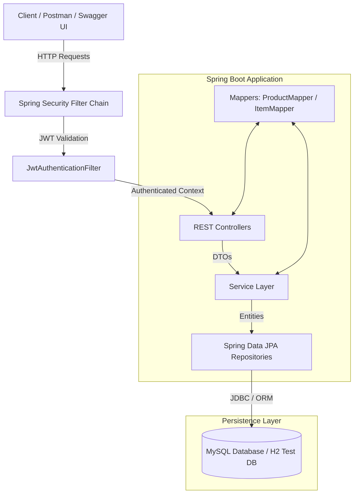
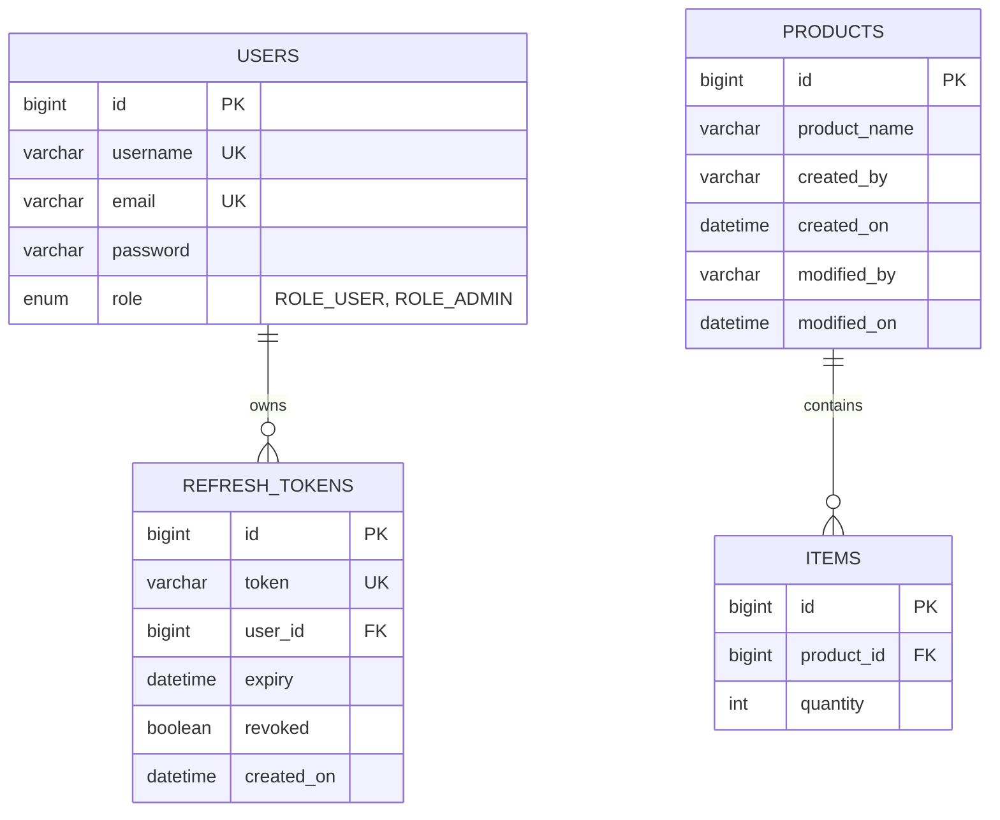
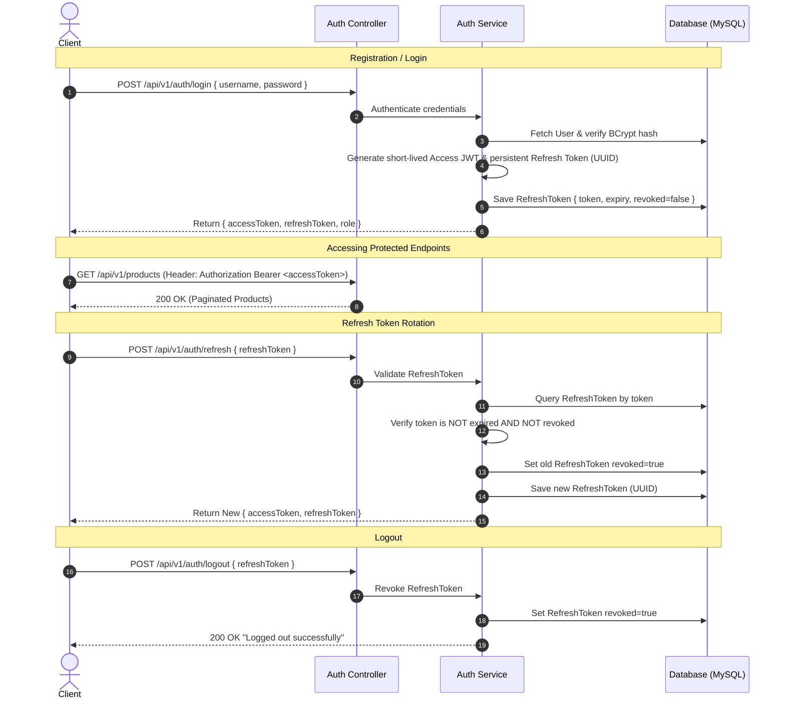
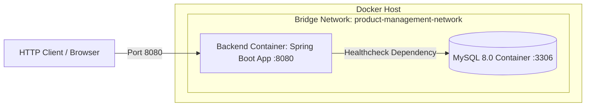

# System Architecture Document

## 1. High-Level Architecture Overview

The **Product Management API** is built following a clean, decoupled, layered architectural style. It enforces a strict separation of concerns across presentation, security, business logic, data persistence, and data transfer.



---

## 2. Layered Architecture Breakdown

```text
com.varad.productmanagement
├── config/       # Spring Security, OpenAPI, Startup Data Seeding
├── controller/   # REST API Endpoints & Request Validation
├── service/      # Core Business Logic & Transaction Boundaries
├── repository/   # Data Access Interfaces (Spring Data JPA)
├── dto/          # Data Transfer Objects (Decoupled API Schemas)
├── entity/       # Persistent JPA Data Entities
├── security/     # Token Processing & UserDetailsService
├── exception/    # Custom Exceptions & Centralized Error Handler
├── mapper/       # Entity-to-DTO Mappers
└── util/         # Shared System Utilities
```

### 1. Presentation & Controller Layer (`controller/`)
- Exposes RESTful HTTP endpoints (`/api/v1/auth`, `/api/v1/products`, `/api/v1/products/{id}/items`).
- Validates request bodies using `@Valid` and Jakarta Validation annotations.
- Converts HTTP path variables and query parameters to Java types.
- Delegates business execution to service interfaces and returns standard `ResponseEntity` wrappers.

### 2. Security & Authentication Layer (`security/` & `config/`)
- Intercepts incoming requests using `JwtAuthenticationFilter` before reaching controller endpoints.
- Validates Bearer Access Tokens and populates Spring Security's `SecurityContextHolder`.
- Enforces role-based URL authorization rules (`ROLE_USER`, `ROLE_ADMIN`) in `SecurityConfig`.
- Hashes and verifies passwords securely using `BCryptPasswordEncoder`.

### 3. Business Logic Layer (`service/`)
- Enforces system constraints, transactional integrity (`@Transactional`), and business validation rules.
- Performs audit logging for entity mutations (`createdBy`, `modifiedBy`).
- Manages pagination parameters and enforces maximum page size limits (capped at 100).
- Implements single-use Refresh Token rotation logic.

### 4. Data Access & Persistence Layer (`repository/` & `entity/`)
- Extends Spring Data `JpaRepository` interfaces for zero-boilerplate DB queries.
- Manages database schemas, constraints, foreign key relationships, and indexes using JPA/Hibernate annotations.
- Utilizes `@PrePersist` and `@PreUpdate` entity lifecycle callbacks to automate creation and modification timestamps.

---

## 3. Entity Relationship (ER) Diagram



---

## 4. Authentication & Token Rotation Flow



---

## 5. Security & Authorization Matrix

| Endpoint | Method | Public | `ROLE_USER` | `ROLE_ADMIN` |
|---|---|:---:|:---:|:---:|
| `/api/v1/auth/**` | `POST` | ✅ | ✅ | ✅ |
| `/v3/api-docs/**`, `/swagger-ui/**` | `GET` | ✅ | ✅ | ✅ |
| `/api/v1/products` | `GET` | ❌ | ✅ | ✅ |
| `/api/v1/products/{id}` | `GET` | ❌ | ✅ | ✅ |
| `/api/v1/products` | `POST` | ❌ | ❌ | ✅ |
| `/api/v1/products/{id}` | `PUT` | ❌ | ❌ | ✅ |
| `/api/v1/products/{id}` | `DELETE` | ❌ | ❌ | ✅ |
| `/api/v1/products/{id}/items` | `GET` | ❌ | ✅ | ✅ |
| `/api/v1/products/{id}/items` | `POST` | ❌ | ❌ | ✅ |
| `/api/v1/products/{id}/items/{itemId}` | `PUT` | ❌ | ❌ | ✅ |
| `/api/v1/products/{id}/items/{itemId}` | `DELETE` | ❌ | ❌ | ✅ |

---

## 6. Exception & Error Response Architecture

All system exceptions are captured by `GlobalExceptionHandler` (`@RestControllerAdvice`) and converted into a standard error response structure:

```json
{
  "timestamp": "2026-09-02T10:30:00",
  "status": 400,
  "error": "Bad Request",
  "message": "Validation failed",
  "path": "/api/v1/products",
  "errors": {
    "productName": "Product name is required"
  }
}
```

### Exception Mapping Table
| Exception Class | Response Status | Description |
|---|---|---|
| `ResourceNotFoundException` | `404 Not Found` | Entity missing in database (e.g. Product or Item ID not found) |
| `BadRequestException` | `400 Bad Request` | Invalid credentials, duplicate username/email, expired/revoked refresh token |
| `MethodArgumentNotValidException` | `400 Bad Request` | Field-level validation failure (mapped in `errors` object) |
| `BadCredentialsException` | `400 Bad Request` | Invalid login credentials |
| `AccessDeniedException` | `403 Forbidden` | Authenticated user lacks required role (`ROLE_USER` calling ADMIN endpoint) |
| `AuthenticationException` | `401 Unauthorized` | Missing or invalid JWT access token |

---

## 7. Deployment & Infrastructure Architecture



- **Containerization**: Multi-stage Docker build using `maven:3.9.6` for packaging and `eclipse-temurin:17-jre-alpine` for execution.
- **Orchestration**: `docker-compose.yml` configures service dependencies where the backend container waits for MySQL's native `healthcheck` (`mysqladmin ping`) to report `healthy` before launching.
